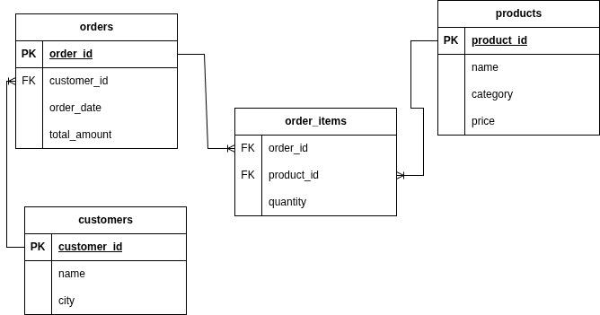

Задания для отработки оконных функций (функции агрегации)

ER-диаграмма БД цветочного магазина

Задача 1:
Для каждой позиции заказа выведите:
количество товара
общее количество всех проданных товаров

Задача 2:
Для каждой позиции заказа выведите:
количество товара
общее количество товаров в этом заказе

Задача 3:
Для каждой позиции заказа выведите:
количество товара
среднее количество товаров в заказах

Задача 4:
Для каждой позиции заказа выведите:
количество товара
максимальное количество товара в любой позиции

Задача 5:
Для каждой позиции заказа выведите:
количество товара
максимальное количество товара в рамках этого заказа

Задача 6:
Для каждой позиции заказа выведите:
выручку по позиции (quantity * price)
общую выручку по всем заказам

Задача 7:
Для каждой позиции заказа выведите:
выручку по позиции
общую выручку по этому заказу

Задача 8:
Для каждой позиции заказа выведите:
выручку по позиции
среднюю выручку по всем позициям
;

Задача 9:
Для каждой позиции заказа выведите:
выручку по позиции
накопительную выручку по дате заказа

Задание 10:
Для каждой позиции заказа выведите:
выручку по позиции
накопительную выручку по заказу (по product_id)

Задание 11:
Для каждой позиции заказа выведите:
выручку по позиции
долю этой позиции в общей выручке всех заказов

Задание 12:
Для каждой позиции заказа выведите:
выручку по позиции
долю этой позиции в выручке конкретного заказа

Задание 13:
Для каждой позиции заказа выведите:
выручку по позиции
общую выручку заказа
среднюю выручку по позициям заказа

Задание 14:
Для каждой позиции заказа выведите:
выручку по позиции
максимальную выручку среди позиций этого заказа
минимальную выручку среди позиций этого заказа

;

Задача 15:
Для каждой позиции заказа выведите:
выручку по позиции
накопительную выручку по заказу
общую выручку заказа

